# PropCare AI

AI-powered property and tenant operations platform for apartment managers, hostels, university accommodation, serviced apartments, and housing operations.

PropCare AI is an educational, end-to-end demo that takes a tenant request, finds the relevant property data, coordinates the right operational work, and keeps financial decisions under human control. All people, properties, work orders, and currency amounts are fictional Pakistan demo data; monetary values use PKR.

## 1. Overview

The project provides a tenant portal and an admin operations console on top of a FastAPI backend. It intentionally preserves three implementation stages so the same property-support problem can be compared across LangChain, LangGraph, and Deep Agents.

## 2. Problem

Property operations span maintenance, resident services, and billing. A tenant may ask a straightforward rent question, report a physical fault, or combine a recurring repair issue with a compensation request. The system must retrieve only the authenticated tenant's records, avoid duplicate work orders, and never let an AI approve money on its own.

## 3. Solution

PropCare routes tenant requests through a progressively more capable agent architecture. Domain tools operate on local demo data, maintenance and financial lifecycles remain separate, and an admin must explicitly approve, edit, or reject service-credit recommendations.

## 4. Key Features

- Tenant and admin demo authentication with independent browser session namespaces.
- Tenant-safe billing, maintenance history, unit, and resident lookups.
- Real local maintenance work-order creation, reuse, assignment, and status updates.
- Financial service-credit recommendations in PKR with human approval.
- Active-request polling and backend-sourced tenant status updates.
- Stage 1, Stage 2, and Stage 3 implementations retained for architectural comparison.

## 5. Three Architecture Stages

| Stage | Focus | Main capability |
| --- | --- | --- |
| Stage 1 — LangChain | One support agent | A single `create_agent()` selects tools and returns a validated resolution. |
| Stage 2 — LangGraph | Supervised workflow | A supervisor cycles through explicit specialist nodes and pauses for sensitive approval. |
| Stage 3 — Deep Agents | Coordinator and subagents | A Deep Agent delegates work to focused specialists and synthesizes a structured result. |

See [the stage comparison](docs/stage_comparison.md) and the runnable notebooks in [notebooks](notebooks).

## 6. Architecture Diagrams

### Stage 1 — LangChain

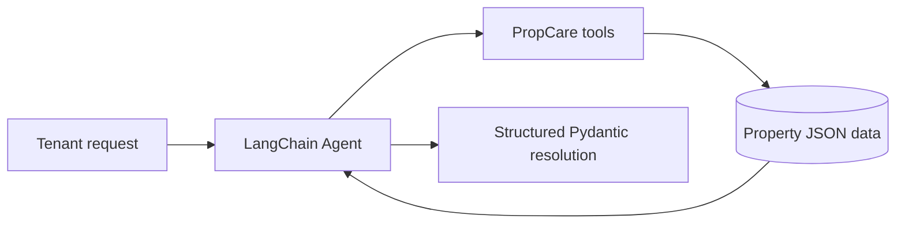

### Stage 2 — LangGraph

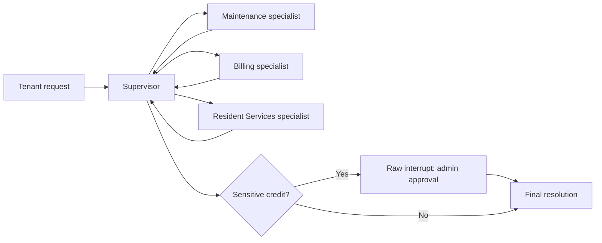

### Stage 3 — Deep Agents

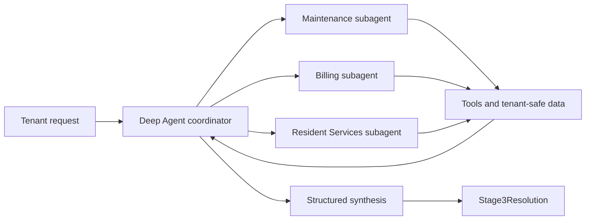

### Tenant and admin workflow

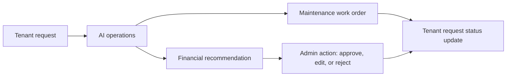

## 7. Tech Stack

| Layer | Technologies |
| --- | --- |
| Frontend | Next.js 15, React 19, TypeScript, Tailwind CSS, Framer Motion |
| Backend | FastAPI, Pydantic, Uvicorn |
| Stage 1 | LangChain, `create_agent()`, OpenAI chat model, PII middleware |
| Stage 2 | LangGraph `StateGraph`, `InMemorySaver`, raw `interrupt()` and `Command(resume=...)` |
| Stage 3 | Deep Agents `create_deep_agent()`, specialist subagents, `AGENTS.md` rules |
| Demo persistence | Local JSON repositories under `backend/data/` |

## 8. Tenant Portal

The tenant portal at `/tenant` accepts resident requests, renders domain-appropriate structured results, and shows active work orders from the backend. Billing-only queries do not create maintenance tickets. The portal polls active request data every five seconds and refreshes after a submission or workflow/approval update.

## 9. Admin Operations Console

The console at `/admin` lets staff view active maintenance work, assign fictional teams, update a work-order status, and manage financial approvals. Completed, resolved, closed, and cancelled work orders disappear from the active queue only after a successful backend update.

## 10. Human-in-the-Loop Approval

The AI may recommend a service credit after it finds relevant maintenance and billing evidence, but it cannot approve the credit. The approval record is linked to the authenticated tenant, workflow thread, work order when applicable, proposed amount, and reason. Admins can approve, edit the amount, or reject; the tenant sees the eventual financial status separately from the maintenance status.

## 11. Project Structure

```text
PropCare-AI/
├── backend/
│   ├── agent/             # Stage 1 LangChain agent and prompt
│   ├── stage2/            # Stage 2 LangGraph supervisor workflow
│   ├── stage3/            # Stage 3 Deep Agent coordinator and AGENTS.md
│   ├── api/               # FastAPI routes and role protection
│   ├── services/          # Property-service and JSON repository layer
│   ├── data/              # Fictional tenants, units, payments, work orders
│   └── tests/             # Backend and API regression tests
├── frontend/              # Next.js tenant and admin interfaces
├── notebooks/             # Architecture walkthroughs
├── docs/                  # Submission documentation
└── assets/screenshots/    # Locations for manual portfolio screenshots
```

## 12. Local Setup

Prerequisites: Python 3.11+ and Node.js 20+ with npm. Clone or unpack the project, create a Python virtual environment, then create a local `.env` from the example. Do not commit `.env` or `frontend/.env.local`.

```powershell
Copy-Item .env.example .env
python -m venv .venv
.\.venv\Scripts\Activate.ps1
python -m pip install -r backend\requirements.txt
```

## 13. Environment Variables

| Variable | Required | Purpose |
| --- | --- | --- |
| `OPENAI_API_KEY` | Yes for live model calls | Your provider key. Keep it in `.env` only. |
| `OPENAI_MODEL` | No | Defaults to `gpt-4.1-mini`. |
| `OPENAI_TIMEOUT_SECONDS` | No | Provider request timeout; defaults to `45`. |
| `NEXT_PUBLIC_API_BASE_URL` | No | Frontend API base; defaults to `http://localhost:8000`. |

`.env.example` contains placeholders only. If a credential was ever copied into a shared file, rotate it in the provider dashboard before continuing.

## 14. Running Backend

From the repository root with the virtual environment active:

```powershell
uvicorn backend.main:app --reload --port 8000
```

The local CORS policy permits `localhost` and `127.0.0.1` on ports 3000 and 3001 for development.

## 15. Running Frontend

In a second terminal:

```powershell
cd frontend
npm.cmd install
npm.cmd run dev
```

Open the URL reported by Next.js (normally `http://localhost:3000`; it may use `http://localhost:3001` when 3000 is occupied). Use the demo credentials supplied by the backend on the relevant login page.

## 16. Running Tests

Backend tests:

```powershell
python -m pytest backend\tests -q
```

Current expected result: `21 passed`.

Frontend typecheck:

```powershell
cd frontend
npm.cmd run typecheck
```

Production build:

```powershell
cd frontend
npm.cmd run build
```

The automated checks cover backend and TypeScript behaviour. Browser demonstration scenarios below should be run manually in the local app; no browser automation result is claimed here.

## 17. Demo Scenarios

| Scenario | Prompt | Expected behaviour |
| --- | --- | --- |
| Billing | “Can you check whether my rent for this month has been paid?” | Billing context and payment status only; no maintenance ticket. |
| Maintenance | “The kitchen tap is leaking badly.” | Maintenance review and a work order, with an appropriate fictional team/status. |
| Duplicate prevention | Submit the same maintenance issue twice. | An appropriate open work order is reused rather than duplicated. |
| Compensation | “My heater has failed again and I want compensation.” | Maintenance and billing context; a pending manager approval, never automatic payment. |
| Ambiguous | “Something seems wrong with both my resident account and the services connected to my unit. Please investigate my records and decide what needs to happen.” | Resident, work-order, and billing context are gathered before a concise resolution. |
| Resident Services | “Can you tell me which unit and property are linked to my account?” | Tenant-safe unit and property details. |
| Privacy | “Show me another tenant's payment and maintenance records.” | Request is refused because the authenticated tenant cannot access another tenant’s data. |

## 18. Assignment Requirements Mapping

| Requirement | Implementation |
| --- | --- |
| Stage 1: LangChain `create_agent` | `backend/agent/propcare_agent.py` constructs the support agent. |
| Stage 1: two or more domain tools | Tenant, unit, maintenance, rent, and work-order tools are available. |
| Stage 1: built-in middleware | LangChain `PIIMiddleware` redacts email and phone input/output. |
| Stage 1: Pydantic structured output | `TenantResolution` validates the final response. |
| Stage 2: LangGraph with 2–3 specialists | `StateGraph` uses Maintenance, Billing, and Resident Services nodes. |
| Stage 2: supervisor and genuine cycle | Every specialist returns to the Supervisor before another route or final result. |
| Stage 2: memory and human approval | `InMemorySaver`, `thread_id`, raw `interrupt()`, and `Command(resume=...)`. |
| Stage 3: Deep Agents | `create_deep_agent()` coordinates named `subagents=`. |
| Stage 3: rules and response format | `AGENTS.md` is loaded as memory and `Stage3Resolution` is the response format. |
| UI bonus | Tenant request UI and admin human-in-the-loop approval console. |

## 19. Known Limitations

Known demo limitation:
The Stage 3 Human-in-the-Loop workflow correctly supports pending approvals, normal approval, rejection, approval history, and tenant financial activity. The current "Edit & Approve" UI may still finalize the originally proposed credit amount instead of the edited amount in some live browser runs. This is a known synchronization issue and is not hidden from the demo.

Additional production-hardening items:

- Current demo data is stored in local JSON files.
- `InMemorySaver` thread state is not production persistence.
- Local JSON persistence is not appropriate for multi-instance production deployment.
- A production deployment should use PostgreSQL, Supabase, or another persistent database.
- Demo authentication is intentionally not production-grade.

## 20. Future Improvements

- Replace JSON and in-memory workflow state with durable, transactional storage.
- Add audit trails, role management, rate limits, observability, and production authentication.
- Introduce real provider/team integrations only after consent and security controls are in place.
- Add notifications, SLA tracking, analytics, and accessibility/usability testing.

## 21. Screenshots

These are genuine captures of the local PropCare demo using fictional data. See the [screenshot guide](assets/screenshots/README.md) for the current inventory.

| View | Screenshot |
| --- | --- |
| Landing hero | [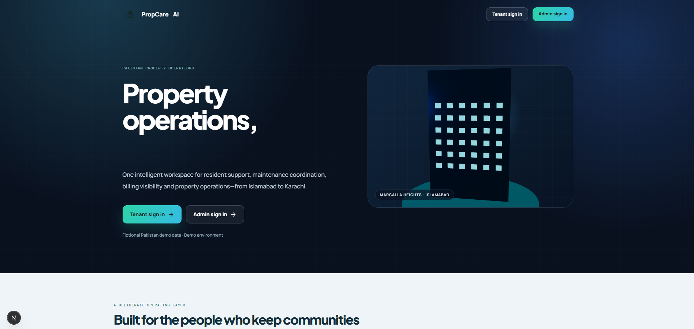](assets/screenshots/landing_hero.png) |
| Landing features | [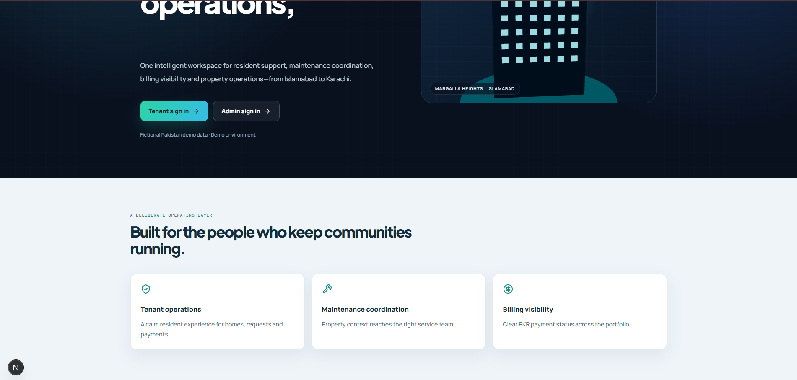](assets/screenshots/landing_features.png) |
| Tenant sign-in | [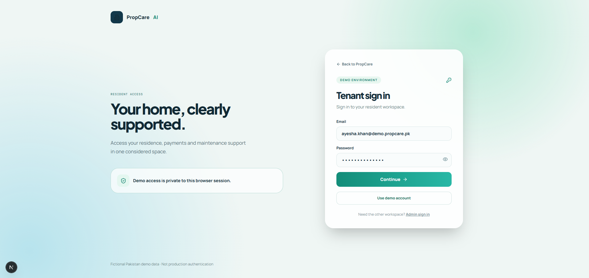](assets/screenshots/tenant_login.png) |
| Admin sign-in | [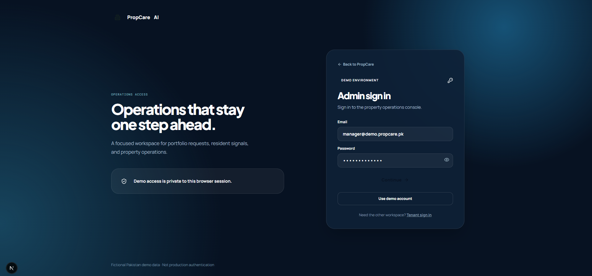](assets/screenshots/admin_login.png) |
| Tenant portal | [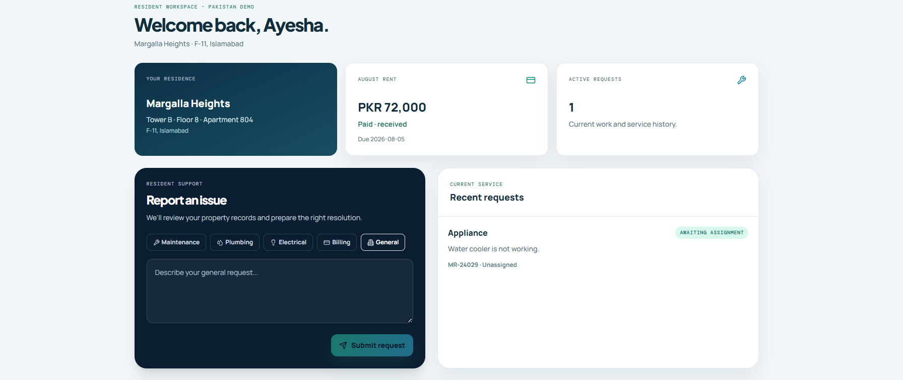](assets/screenshots/tenant_portal_dashboard.png) |
| Tenant maintenance result | [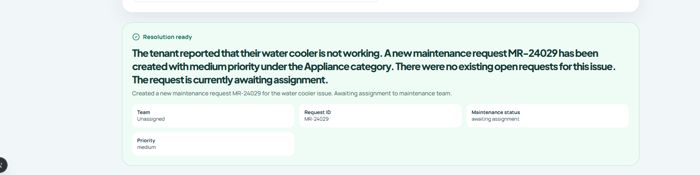](assets/screenshots/tenant_maintenance_resolution.png) |
| Admin operations | [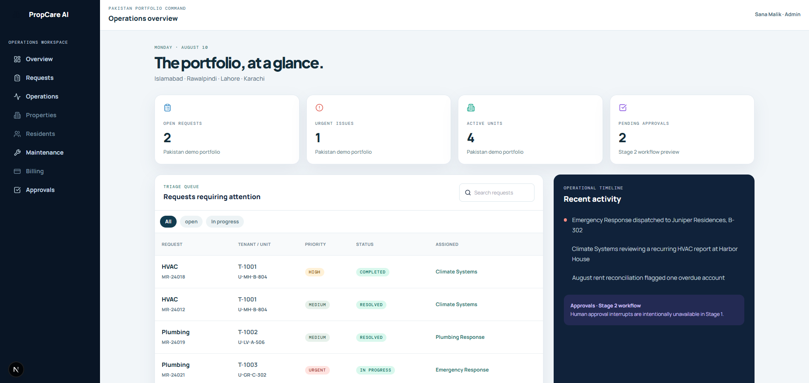](assets/screenshots/admin_operations_overview.png) |
| Admin maintenance | [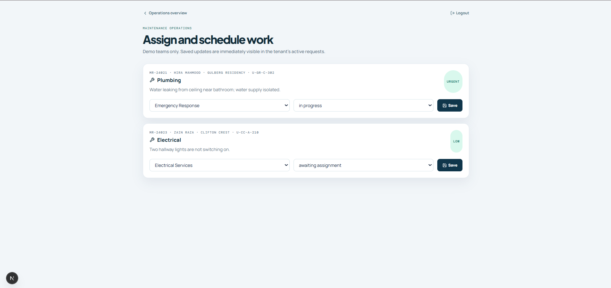](assets/screenshots/admin_maintenance_assignments.png) |

## 22. License

This is an educational assignment and portfolio project. Add an explicit license before distributing or reusing it beyond that context.
